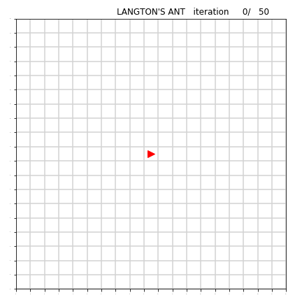
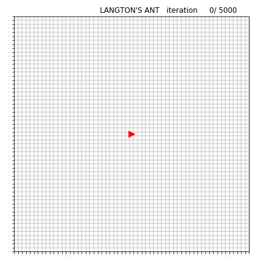
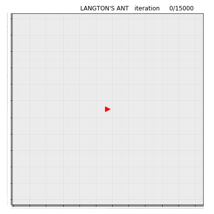

# Langton's-Ant
Langton's Ant simulation implemented in Python, a demonstration that simple rules can create complex behavior

**Rules :**
1) on a white square, turn 90° right
2) on a black square, turn 90° left
3) when moving, the ant change the color of the current square

